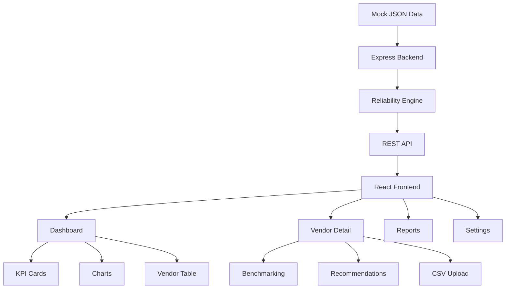

# Reliability Analytics Dashboard

> **Give local vendors data to improve, not just complaints to ignore.**

A modern, full-stack analytics dashboard built for the **ParaNode Online Hackathon**. This MVP enables marketplace admins to monitor vendor reliability and empowers vendors to understand, benchmark, and improve their own performance.

---

## Problem

Local vendors in hyperlocal marketplaces have little visibility into their delivery success, complaint patterns, response times, or overall reliability. They only hear about problems after complaints arise. Marketplace admins lack a unified view to identify low-performing vendors before issues escalate.

## Solution

The Reliability Analytics Dashboard converts raw vendor operational data into clear, visual, actionable insights:

- **Admins** get platform-wide monitoring, searchable vendor directories, KPI summaries, and exportable reports.
- **Vendors** get a personal dashboard with their reliability score, competitive benchmarking, dynamic recommendations, and the ability to upload their own data.

---

## Key Features

### Authentication & RBAC

- Login / Logout with role-based redirection
- Protected routes enforced server-side
- RoleGuard isolates vendor data (vendors can only see their own records)

### Admin Features

| Feature | Description |
|---------|-------------|
| Dashboard | Platform overview with KPI cards, charts, and vendor table |
| Vendor Directory | Searchable, sortable table with reliability indicators |
| Reports | Platform summary, CSV/JSON export, quick report preview |
| Analytics | Delivery trends, complaint breakdowns, region analytics |
| Search & Sort | Filter by vendor name, sort by score, complaints, or rating |

### Vendor Features

| Feature | Description |
|---------|-------------|
| Personal Dashboard | Own reliability score, order breakdown, weekly delivery trends |
| Benchmarking | Rank, platform average, gap to top performer |
| Recommendations | Rule-based advice (complaint volume, response time, score) |
| CSV Upload | Upload own performance data and see scores update instantly |

### Analytics & Intelligence

- **Reliability Formula** — score computed from completed / (completed + failed) orders
- **Dynamic Insights** — top performers, worst complaint vendors, good-performer percentage
- **Region Analytics** — per-region average reliability scores
- **Complaint Analytics** — per-vendor complaint bar chart
- **Delivery Trends** — platform-wide weekly delivery rate line chart

### Data Management

- **CSV Upload** — vendors upload `.csv` files with `date, completedOrders, failedOrders, complaints`
- **CSV Export** — download vendor directory as CSV
- **JSON Export** — download vendor directory as JSON

### UI / UX

- Dark Mode / Light Mode toggle
- Responsive design (mobile, tablet, desktop)
- Skeleton loaders during data fetching
- Animated KPI counters (CountUp)
- Fade-in page transitions
- Consistent card, chart, and table styling

---

## System Workflow



---

## User Roles

### Admin

- View all vendors and platform-wide metrics
- Access analytics, charts, and region breakdowns
- Search, sort, and filter the vendor directory
- Generate CSV/JSON reports
- View any vendor's detail page with benchmarking and recommendations
- Access Settings

### Vendor

- View own reliability score, order data, and delivery trends
- Upload CSV performance data to update scores in real time
- View personal benchmarking (rank, platform average, gap to top)
- Receive dynamic, data-driven recommendations
- Access Settings (theme, account info)

> Vendors **cannot** view other vendors' data. RoleGuard enforces strict data isolation at the route level.

---

## Reliability Score Formula

```
Reliability Score = (completedOrders / (completedOrders + failedOrders)) × 100
```

Computed server-side for every vendor on every request.

### Status Tiers

| Score Range | Status |
|-------------|--------|
| > 80        | Good   |
| 60 – 80     | Average |
| < 60        | Poor   |

---

## Tech Stack

### Frontend

| Library | Purpose |
|---------|---------|
| React 19 | UI framework |
| Vite 5 | Build tool |
| Tailwind CSS 3 | Utility-first styling |
| Recharts 2 | Charts (bar, line, pie) |
| React Router 7 | Client-side routing |
| Axios | HTTP client |
| Lucide React | Icons |
| React CountUp | Animated number counters |

### Backend

| Library | Purpose |
|---------|---------|
| Node.js | Runtime |
| Express | Web framework |
| CORS | Cross-origin support |

### Data Layer

| File | Purpose |
|------|---------|
| `data/vendors.json` | 10 vendor records with weekly delivery data |
| `data/users.json` | Mock user credentials for login |
| `data/complaints.json` | Aggregated complaint data for charts |

---

## API Documentation

### Authentication

| Method | Endpoint | Description |
|--------|----------|-------------|
| POST | `/api/auth/login` | Authenticate user. Accepts `{ username, password }`. Returns user object with `role` and `vendorId`. |

### Vendors

| Method | Endpoint | Description |
|--------|----------|-------------|
| GET | `/api/vendors` | List all vendors with computed `reliabilityScore` and `status`. Supports `?search=` and `?sort=` (score, complaints, rating). |
| GET | `/api/vendors/:id` | Returns a single vendor with full fields including `weeklyData`. |

### Analytics

| Method | Endpoint | Description |
|--------|----------|-------------|
| GET | `/api/summary` | Platform summary — `totalVendors`, `avgReliabilityScore`, `totalComplaints`, `topPerformer`. |
| GET | `/api/stats/complaints` | Per-vendor complaint counts for the bar chart. |
| GET | `/api/stats/deliveries` | Aggregated weekly delivery rate across all vendors for the line chart. |

---

## Screenshots

<!-- TODO: Add screenshots here. Recommended images: -->

| Page | Preview |
|------|---------|
| **Login** | `screenshots/login.png` |
| **Admin Dashboard** | `screenshots/dashboard.png` |
| **Vendor Detail** | `screenshots/vendor-detail.png` |
| **Reports** | `screenshots/reports.png` |
| **Settings** | `screenshots/settings.png` |

<!--
Create a `screenshots/` folder at the project root and add images named as above.
Suggested dimensions: 1280×800 or 1920×1080.
-->

---

## Getting Started

### Prerequisites

- Node.js v18+
- npm or yarn

### Installation

```bash
# Clone the repository
git clone https://github.com/ParaNode-Online-Hackathon-1-2026/reliability-analytics-dashboard.git
cd reliability-analytics-dashboard

# Install frontend dependencies
npm install

# Install backend dependencies
cd server
npm install
cd ..
```

### Running Locally

You need two terminal windows.

**Terminal 1 — Backend (Express)**

```bash
cd server
node index.js
```

Backend runs at `http://localhost:5000`

**Terminal 2 — Frontend (Vite)**

```bash
npm run dev
```

Frontend runs at `http://localhost:5173`

### Demo Credentials

| Role | Username | Password |
|------|----------|----------|
| Admin | `admin` | `admin123` |
| Vendor | `supplyco` | `vendor123` |

---

## Future Scope

- **Persistent storage** — migrate from JSON files to MongoDB or PostgreSQL
- **JWT authentication** — token-based secure sessions
- **bcrypt password hashing** — secure credential storage
- **Vendor API integration** — live data ingestion from vendor systems
- **ML reliability prediction** — forecast future scores based on historical trends
- **Complaint sentiment analysis** — categorize and analyze customer feedback
- **Real-time analytics** — live dashboard updates via WebSockets
- **Smart alerts** — automatic notifications for poor-performing vendors
- **Vendor registration** — self-service onboarding with approval workflow

---

## Hackathon Context

Built during the **ParaNode Online Hackathon** as a functional MVP demonstrating:

- Full-stack React + Express development
- Role-based access control (Admin / Vendor)
- Data-driven analytics and visualization
- Vendor benchmarking and self-service data upload
- Professional SaaS-style UI with dark mode

The project emphasizes **practical analytics over theoretical dashboards** — every feature solves a real problem for marketplace operators and local vendors.

---

## License

MIT
